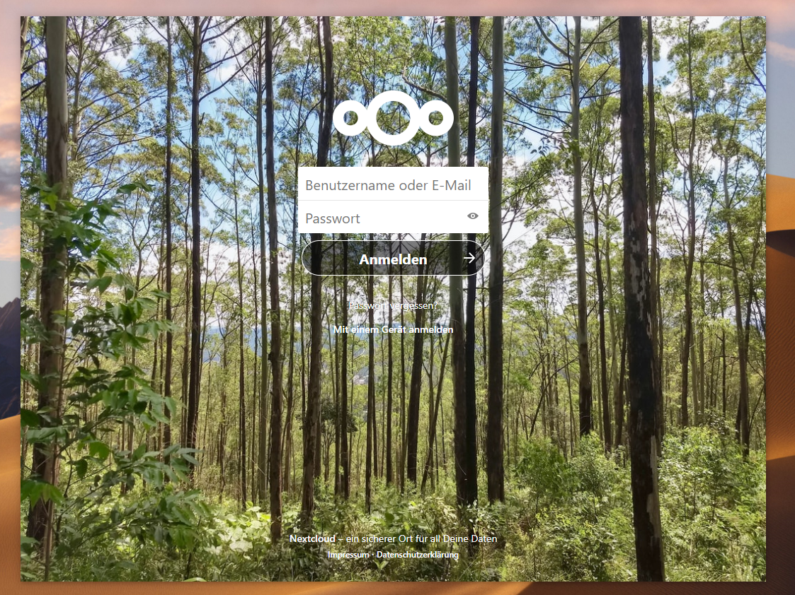

# Nextcloud-Frameless-Window
Your Nextcloud as an own frameless window.



## Configure your Nextcloud instance
**NOTICE**: You need to set up a one-time configuration on your Nextcloud, which needs administrative permissions. 

1. Install the [Custom CSS](https://apps.nextcloud.com/apps/theming_customcss) Nextcloud app.
2. Go to Settings > Administration > Theming and add the following CSS-Style into the "Custom CSS"-Section. This will utilize the Nextcloud Logo and empty navigation space as moving area for the desktop window:
```css
header > .header-left {
  -webkit-app-region: drag;
}

header > .header-left > #appmenu {
  -webkit-app-region: no-drag;
}

header > .header-left > nav {
  -webkit-app-region: no-drag;
}
```
Now you're done with your Nextcloud setup.

## Configure your frameless window
1. Download the newest version of Nextcloud-Frameless-Window under the [GitHub releases section](https://github.com/getNameFromUser/Nextcloud-Frameless-Window/releases/).
2. At the first start of Nextcloud-Frameless-Window you need to enter the URL of your Nextcloud instance. After entering, you will be redirected to the Nextcloud login screen.
3. After login, you can move yor window using the Nextcloud Logo and empty navigation space. Right-clicking on those spaces on Windows will bring up a menu to maximize, minimize and close the window.

Nextcloud-Frameless-Window will remember the last window position and size. Restarting the app will bring up the window on the same location as it was closed.

The Nextcloud URL will be saved in url.conf. Deleting the file will reopen the configuration dialog on startup.

## Used OpenSource Libraries

+ [electron/electron](https://github.com/electron/electron) to create the frameless window. *MIT-Licence*
+ [electron/remote](https://github.com/electron/remote) @electron/remote *MIT-Licence*
+ [mawie81/electron-window-state](https://github.com/mawie81/electron-window-state) to remember the last window position. *MIT-Licence*

**Other**:
+ [electron/electron-packager](https://github.com/electron/electron-packager) to build the binaries. *BSD 2-Clause "Simplified" License*
+ [juliushaertl/theming_customcss](https://github.com/juliushaertl/theming_customcss) to configure the css styles on your Nextcloud instance.
+ [nextcloud/server](https://github.com/nextcloud/server): Your Nextcloud instance.
